<p align="center">
  
</p>

# AlzetteLink: Industrial IoT Educational Bridge

**AlzetteLink** is a comprehensive Industrial IoT (IIoT) educational platform designed to bridge the gap between operational technology (OT) and information technology (IT). It demonstrates the complete flow of data from a low-level microcontroller (ESP32) to a high-level web dashboard via modern industry-standard protocols.

Designed for technical students at **Lycée Technique**, this project introduces core Industry 4.0 concepts:
- **Edge Computing**: ESP32 sensor logic.
- **Connectivity**: MQTT (Message Queuing Telemetry Transport).
- **Data Persistence**: InfluxDB (Time-series database).
- **Visualization**: React & Real-time WebSockets.

---

## 🏗️ Architecture

The system consists of three main modular components:

1.  **Firmware (`/firmware`)**: C++ code running on an ESP32. It acts as a "Smart Sensor", reading data and publishing JSON payloads to an MQTT broker.
2.  **Infrastructure & Backend**:
    - **MQTT Broker**: Eclipse Mosquitto (Docker).
    - **Database**: InfluxDB (Docker).
    - **Bridge Service (`/bridge-service`)**: A Node.js microservice that subscribes to the broker and persists data to InfluxDB.
3.  **Frontend (`/web-dashboard`)**: A modern React application that subscribes directly to the MQTT broker (via WebSockets) to display real-time gauges, charts, and status indicators.

```mermaid
graph LR
    subgraph Edge["🔌 Edge Layer"]
        ESP32["ESP32<br/>Sensor"]
    end

    subgraph Infrastructure["☁️ Infrastructure (Docker)"]
        MQTT["Mosquitto<br/>MQTT Broker"]
        DB["InfluxDB<br/>Database"]
    end

    subgraph Backend["⚙️ Backend"]
        Bridge["Bridge Service<br/>Node.js"]
    end

    subgraph Frontend["🖥️ Frontend"]
        Dashboard["React Dashboard<br/>Tailwind + Chart.js"]
    end

    ESP32 -->|"JSON/MQTT<br/>:1883"| MQTT
    MQTT -->|"Subscribe"| Bridge
    Bridge -->|"Write"| DB
    MQTT -->|"WebSocket<br/>:9001"| Dashboard
    Dashboard -.->|"Query History"| DB
```



### 📸 Dashboard Demo

<p align="center">
  
</p>

---

## 🚀 Getting Started

### Prerequisites
- [Docker & Docker Compose](https://www.docker.com/)
- [Node.js](https://nodejs.org/) (v16+)
- [VS Code](https://code.visualstudio.com/) with PlatformIO (recommended) or Arduino IDE.

### 1. Infrastructure Setup
Start the local server environment:
```bash
docker-compose up -d
```
This launches Mosquitto (MQTT Broker) on ports `1883` (TCP) and `9001` (WebSockets), and InfluxDB on `8086`.

### 2. Backend Bridge Service
Install and run the data logger:
```bash
cd bridge-service
npm install
node index.js
```
*Note: Ensure you update the `.env` or configuration lines in `index.js` with your InfluxDB token if you want to save data.*

### 3. Web Dashboard
Launch the real-time visualization:
```bash
cd web-dashboard
npm install
npm run dev
```
Open `http://localhost:5173` in your browser.

### 4. Firmware (ESP32)
1.  Open `/firmware` in **PlatformIO** (VS Code) or Arduino IDE.
2.  Edit `src/main.cpp`:
    - Update `ssid` and `password` with your WiFi credentials.
    - Update `mqtt_server` with your PC's IP address.
3.  Upload code to your ESP32.
4.  Open the Serial Monitor to verify connection.

### 5. Simulator (No Hardware Required)
If you don't have an ESP32, use the simulator to test the dashboard:
```bash
cd simulator
npm install
npm start
```
The simulator will publish fake sensor data every 2 seconds.

---

## 🎓 Student Contribution

This project is a boilerplate. Your goal is to expand it into a real industrial monitoring solution.

### Level 1: The Basics 🟢
- [ ] **Modify the Data**: Change the dummy temperature generation in `main.cpp` to simulate a "Sine Wave" or connect a real DHT11/DHT22 sensor.
- [ ] **Custom Topic**: Change the MQTT topic from `data` to `factory/machine01/telemetry` and update the Dashboard and Bridge to match.

### Level 2: Advanced Logic 🟡
- [ ] **Alert System**: Modify the React dashboard to flash **RED** if the temperature exceeds 30°C.
- [ ] **Two-Way Communication**: Add a "Stop" button on the Dashboard that sends an MQTT message back to the ESP32 to turn on an LED (simulating a machine stop).

### Level 3: Industry 4.0 Pro 🔴
- [ ] **Multi-Sensor Support**: Connect a second ESP32. Modify the dashboard to handle multiple devices dynamically based on their `machine_id`.
- [ ] **Historical Analysis**: Update the Dashboard to fetch generic historical data from InfluxDB instead of just showing the live buffer.

---

## 🔗 References & Credits
- **Project Link**: [GitHub Repository](https://github.com/boubli/AlzetteLink)
- **Author**: [Boubli Tech](https://boubli.tech)
- **Inspiration**: Built upon experience with ESP8266 automation projects (e.g., [Wifi-Jammer-NodeMCU](https://github.com/boubli/Wifi-Jammer-NodeMCU)).
